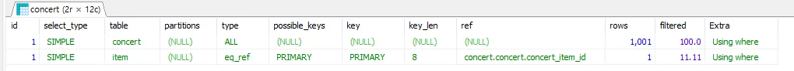
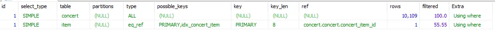

# 인덱스

## 고민 과정: 인덱스 너 뭔데?  🤔

인덱스를 어디에 사용해야 적절하게 사용할 수 있을 까라는 고민이 있었습니다.

일반 Where절에서는 기준에 맞는 것을 찾기 위해서 Full-Scan을 하게 됩니다.

마치 하나의 단어를 찾기 위해서 사전을 1p부터 끝 페이지까지 다 찾아보는 일과 같습니다. 많이 비효율적이죠.

그래서 인덱스 즉, `ㄱ`은 어디있고 `ㅏ`는 어디있고 그곳으로 가서 찾는 것과 같은 일입니다.

그렇다면 인덱스는 모든 곳에서 걸어 놓으면 데이터를 빨리 찾을 수 있어 좋은 것이 아니냐고 할 수 있겠습니다. 하지만 만약, ㄱ만 존재하는 사전이라면 이 `ㄱ`의 인덱스가 필요할지 고민해봐야 합니다.

어딜 펼치나 `ㄱ`이 나오는 데 제가 구입한 인덱스 스티커만 아깝습니다. 그와 같이 이걸 `카디널리티`가 낮다 라고 합니다. 카디널리티 = 중복이라고 생각하면, 가 세션을 가도 `ㄱ` 겨 세션을 가도 `ㄱ` 계속 `ㄱ`이 나오므로 중복도가 높습니다. 즉, 카디널리티 낮은 것 입니다.

하지만, `ㄱ`도 있고, `ㄴ`도 있고, `ㄷ`….쭉쭉 데이터의 종류가 많으면 많을 수록 중복은 적어질 것이고 즉, `카디널리티`가 높습니다.

여기에서 한번 더 생각해보면, 인덱스 좋기만 한가? 라는 의문점이 생깁니다. 개발하면서 생각하는 거지만, **모든 기술에는 좋은 점만 있지 않다는 것입니다.**

위에서 내용을 다시 살펴볼까요?

어딜 펼치나 `ㄱ`이 나오는 데 제가 구입한 **인덱스 스티커**만 아깝습니다.`  현실에서도 인덱스 스티커를 붙이기 위해 **비용**이 들어갑니다. 만약 `ㄱ`, `가` `갸` `거` `겨` …모두 인덱스 스티커를 붙여 놓으면 일단 인덱스 스티커가 엄청 많이 들어갈 것이고요. 인덱스를 붙여 놓을 공간도 없고, 보기가 더 어려워질 것 입니다.

마찬가지로 인덱스 기술을 사용하기 위해서 데이터 베이스에 따로 공간을 구비해야 합니다.

## 적용: 예약 가능 날짜

그래서 저는 Where절을 사용하며, 중복도는 낮은 곳을 찾기 시작했습니다.

특히 Join에 많은 관심을 기울였습니다.
콘서트 예약 가능 날짜를 검색을 할 때, `concert_item` 과 `concert`  Where절에 조건이 두 개며, 날짜가 다양하기 때문에 중복도가 낮다고 생각해서 적합하다고 보였습니다.

### Explain

직접 `Explain` 을 사용해서 성능이 어떤 지 확인 해봅시다.

```sql
Explain
SELECT concert.concert_id, concert.concert_name, concert.concert_location, item.concert_fee 
            FROM concert 
            inner JOIN concert_item AS item 
            ON concert.concert_item_id = item.concert_item_id 
            WHERE item.reservation_start <= :end OR item.reservation_end >= :start
```

### 결과: Full Scan



type이 ALL로 전체 행에 접근 했습니다.

### 적용 전: 속도


```sql
CREATE INDEX idx_concert_item ON concert_item (reservation_start, reservation_end)
```

### 적용 후: 속도


### 결과: filtered 상승



속도의 변화가 클 것이라고 생각했지만, 왠걸 똑같은 결과가 나왔습니다.

제가 만든 index보다 primary key를 사용하는 것이 성능에 있어서 더 좋다고 나옵니다.

# 결론

## 인덱스를 적용함으로 엄청난 성능 향상을 받을 곳이 없다.

처음에는 Join 문이 많으면 많을 수록 Full Scan을 할 것이 많아지니까 인덱스를 해야 할 대상이 아닌가?라고 생각했지만, 실험 결과 성능 향상이 없다는 것을 알게 되었습니다.

하지만, primary key값으로 연결되는 Join문들은 이미 연결 포인트 자체인 키 값이 인덱스가 되어있는 것이기 때문에 적용할 곳이 없다는 결론이 나왔습니다.