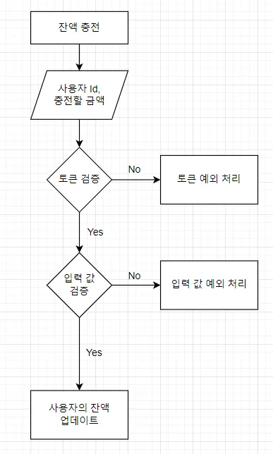

# 고민과정: 트랜잭션 너 뭔데? 🤔

저도 철권이라는 게임을 많이 해본 적 없지만, 이해하기 쉬운 예시인 것 같아서 들고 와봤습니다. 철권은 기본 공격이 있고, 특정 커맨드를 입력하면 더 강력한 스킬이 나가죠.

예를 들어, ↓ 공격 → ← ←을 누른다면 강력한 장풍이 나간다든지요. 이 순서를 바꾸거나 하나라도 놓치면 장풍이 나가지 않을 것입니다.

이와 같이 트랜잭션은 관련 있는 행동(작업)들이 하나로 보장되는 것을 이야기합니다.



## 트랜잭션의 범위?

저는 트랜잭션의 범위라는 것을 지정해줄 수 있는 지는 처음 알았습니다. 제가 이해한 바로는

예를 들면, 철권에서는 물론, 모든 커멘드를 타이밍에 맞게 입력해야 강력한 기술이 나가겠지만, 제가 `↓ 공격 → ← ←` 이 커멘드에서 중간에 하나를 잘못 입력했다고 생각해봅시다.

`↓ 공격 → ↑(잘못 입력) ←` 제가 잘못 입력한 건데, 철권은 생각합니다. 하나 정도는 잘못 입력했어도  `장풍 사용에는 영향이 없도록 해주자!` 아니면 `무슨 소리 이 기술은 다 잘 입력 해야 장풍을 쓸 수 있어` 라고 하는 것과 같이 **어떠한 작업이 다른 작업에 영향을 주느냐 마느냐를 생각하는 것이 트랜잭션의 범위를 생각하는 것**이라고 생각하시면 잘 이해할 수 있습니다.

# 그래서 너의 서비스에서 트랜잭션 고민해야 할 포인트는?

제가 개발한 기능의 트랜잭션이 어떻게 되는 지 한번 살펴보겠습니다.

제가 개발한 기능의 트랜잭션 범위를 생각하기에 앞서 제가 개발한 api를 먼저 살펴보시죠

- 토큰
    - 사용자 토큰 생성
    - 사용자 토큰 상태 확인
- 콘서트
    - 콘서트 예약 가능한 날짜 확인
    - 콘서트 예약 가능한 좌석 확인
    - 콘서트 예약
    - 콘서트 결제
- 사용자 충전
    - 사용자 금액 충전
    - 사용자 금액 확인

트랜잭션의 범위를 생각해보면,

토큰의 경우를 살펴보겠습니다.

1. 사용자의 정보를 확인한다.
2. 토큰을 확인한다. (발급 했 는지, 발급 상태는 어떤 지)
3. 토큰을 생성한다.

토큰 생성 부분에서만 데이터의 변경이 있습니다.

이 와 같이 사용자 충전에서도 사용자 충전 테이블만 데이터 변경이 발생합니다.

또, 확인 GET에는 데이터의 변경이 없기 때문에, 트랜잭션의 범위 부분까지 깊게 생각할 필요가 적습니다.

하지만, 콘서트 결제 부분을 살펴볼까요?

콘서트 결제

1. 사용자 토큰 확인
2. 사용자 금액 결제 하기에 충분한지 확인
3. 콘서트 좌석 확인
4. 사용자 금액 변경 ( 사용자 금액 - 콘서트 비용 )
5. 콘서트 좌석 상태 변경
6. 콘서트 예약 완료 알림 처리 (외부 API)

콘서트 결제 부분에서는 다양한 테이블에서 데이터 변경과 외부 API를 사용하는 일이 발생합니다.

트랜잭션에 대해서 고민해야 할 포인트는 콘서트 결제 기능이겠군요 🧐

데이터의 변경을 더욱 자세하게 보겠습니다.


둘 둘 쪼개서 살펴보겠습니다.

-----
사용자 금액 변경
콘서트 좌석 상태 변경

금액 변경이 완료되고 좌석 상태 변경이 되지 않고 실패 할 경우를 생각해봅시다.
금액이 변경되었는 데, 좌석 상태 변경이 되지 않아서 좌석이 예약 전의 상태로 돌아갔다고 생각하면,
다른 사람이 예약 시 그 자리는 두 사람이 예약 가능한 상황이 벌어질 수 있습니다.

그래서 저는 사용자 금액 변경과 콘서트 좌석 상태 변경은 하나라도 실패 되면 롤백을 시키는 게 맞다고 
생각을 했습니다.

---------------------------------------

콘서트 좌석 상태 변경
콘서트 예약 완료 알림 처리

좌석 상태 변경이 완료 되었습니다. 
예약 완료 알림이 실패 할 경우를 살펴보면, 사용자 입장에서는 완료 알림이 안 오던, 오던 본인은 이미
금액이 까였고 좌석 상태까지 변경 되었는 데 알림 안 왔다고 내 최애의 콘서트 예약 실패가 된다면?
엄청난 항의가 쏟아져오겠죠? 알림 중요할 수 있지만, 콘서트 결제에 있어서는 중요도가 많이 떨어집니다.
 
그렇다면, 한 트랜잭션 내에 있는 것보다는 다른 트랜잭션에 있어서 예약 완료는 결과에 상관 없이 실행되어야 합니다.


``` json
정리하자면
1. 사용자 금액 변경 - 콘서트 좌석 상태 변경은 같은 트랙잭션에 존재
2. 콘서트 좌석 상태 변경 - 콘서트 예약 완료 알림 처리는 다른 트랜잭션에 존재
```


# 그래서 어떻게 구현?

지금 Facade에서 각각 도메인에서 서비스를 구현하고 있습니다.

```java
@Component
public class ConcertFacade {

	@Autowired
	private ConcertReservationService concertReservationService;
	
	@Autowired
	private SeatService seatService;
	
	@Autowired
	private UserChargeService userChargeService;
	
	@Autowired
	private SmsService smsService;

	@Transactional
	public PaymentResponse pay(Long concertId, PaymentRequest request) {
	    concertReservationService.checkRegistrationTime(concertId, request.getUserId()); // 토큰 확인
	    userChargeService.checkValidMoney(request.getUserId(), request.getPrice()); // 사용자 금액 확인
	    seatService.checkSeat(concertId); // 콘서트 좌석 확인
	    userChargeService.pay(concertId, request); // 사용자 금액 변경 (결제)
	    smsService.sendRegistration(request.getUserId()); // 예약 완료 알림 처리
	
	    ConcertEntity concert = concertService.getConcert(concertId);
	
	    LocalDateTime now = LocalDateTime.now();
	    return new PaymentResponse(request.getUserId(), concert, now);
	}
}
```

`@Transactional` 을 사용하면 트랜잭션을 관리할 수 있습니다. 위에서 정리한 것과 같을 생각하면

```java
1. 사용자 금액 변경 - 콘서트 좌석 상태 변경은 같은 트랙잭션에 존재
2. 콘서트 좌석 상태 변경 - 콘서트 예약 완료 알림 처리는 다른 트랜잭션에 존재
```

pay에 `@Transactional` 을 사용하면 첫 번째는 해결 되었습니다.

하지만, 두 번째를 살펴보면 첫 번째 기능들과 알림 처리는 서로 다른 트랜잭션에 존재 해야 합니다.

`@Transactional(propagation = Propagation.REQUIRES_NEW)` ****을 사용하면 pay에서 사용하는 트랜잭션과 다른 별도의 새로운 트랜잭션을 사용할 수 있습니다.

```java
@Service
public class SmsService {

	@Transactional(propagation = Propagation.REQUIRES_NEW)
	public void sendRegistration(Long userId) {
		... 콘서트 예약 완료 문자 보내기
	}
}
```